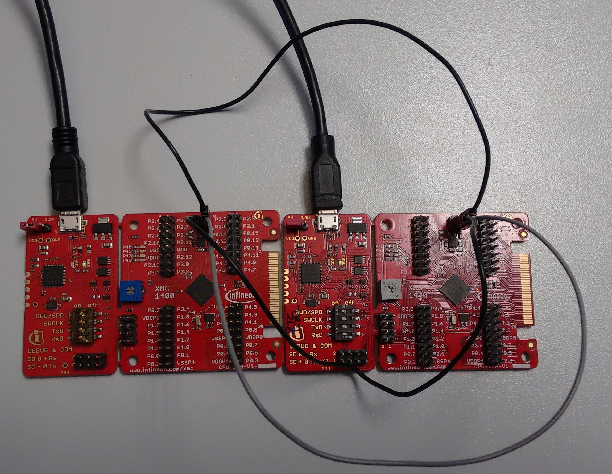
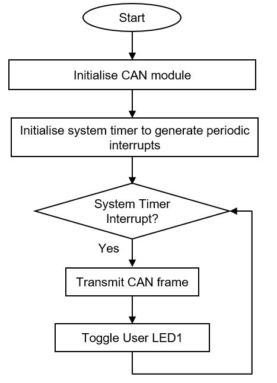
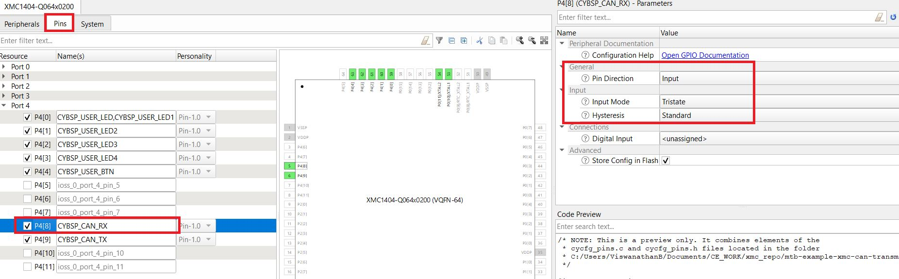
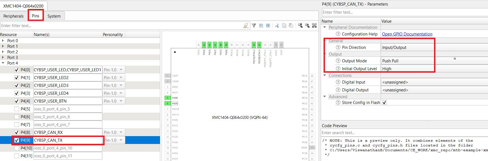
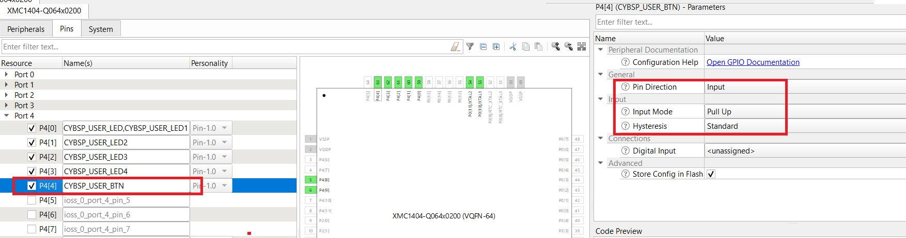

# XMC&trade; MCU: CAN transmitter

This example demonstrates how to transmit CAN messages over the CAN bus using the XMC&trade; MCU. This example can be used with the [CAN receiver](https://github.com/Infineon/mtb-example-xmc-can-receiver) example running on another board.

[View this README on GitHub.](https://github.com/Infineon/mtb-example-xmc-can-transmitter)

[Provide feedback on this code example.](https://cypress.co1.qualtrics.com/jfe/form/SV_1NTns53sK2yiljn?Q_EED=eyJVbmlxdWUgRG9jIElkIjoiQ0UyMzI2MjgiLCJTcGVjIE51bWJlciI6IjAwMi0zMjYyOCIsIkRvYyBUaXRsZSI6IlhNQyZ0cmFkZTsgTUNVOiBDQU4gdHJhbnNtaXR0ZXIiLCJyaWQiOiJicnZpIiwiRG9jIHZlcnNpb24iOiIyLjEuMCIsIkRvYyBMYW5ndWFnZSI6IkVuZ2xpc2giLCJEb2MgRGl2aXNpb24iOiJNQ0QiLCJEb2MgQlUiOiJJQ1ciLCJEb2MgRmFtaWx5IjoiTi9BIn0=)
## Requirements

- [ModusToolbox&trade; software](https://www.infineon.com/modustoolbox) v3.0
- [SEGGER J-Link software](https://www.segger.com/downloads/jlink/#J-LinkSoftwareAndDocumentationPack)
- Programming language: C
- Associated parts: All [XMC&trade; MCU](https://www.infineon.com/cms/en/product/microcontroller/32-bit-industrial-microcontroller-based-on-arm-cortex-m/) parts

## Supported toolchains (make variable 'TOOLCHAIN')

- GNU Arm&reg; embedded compiler v10.3.1 (`GCC_ARM`) - Default value of `TOOLCHAIN`
- Arm&reg; compiler v6.16 (`ARM`)
- IAR C/C++ compiler v9.30.1 (`IAR`)

## Supported kits (make variable 'TARGET')

- [XMC1400 boot kit](https://www.infineon.com/cms/en/product/evaluation-boards/kit_xmc14_boot_001/) (`KIT_XMC14_BOOT_001`) - Default value of `TARGET`
- [XMC4200 Platform2Go kit](https://www.infineon.com/cms/en/product/evaluation-boards/kit_xmc_plt2go_xmc4200/) (`KIT_XMC_PLT2GO_XMC4200`)
- [XMC4300 relax EtherCAT kit](https://www.infineon.com/cms/en/product/evaluation-boards/kit_xmc43_relax_ecat_v1/) (`KIT_XMC43_RELAX_ECAT_V1`)
- [XMC4400 Platform2Go kit](https://www.infineon.com/cms/en/product/evaluation-boards/kit_xmc_plt2go_xmc4400/) (`KIT_XMC_PLT2GO_XMC4400`)
- [XMC4500 relax kit](https://www.infineon.com/cms/en/product/evaluation-boards/kit_xmc45_relax_v1/) (`KIT_XMC45_RELAX_V1`)
- [XMC4700 relax kit](https://www.infineon.com/cms/en/product/evaluation-boards/kit_xmc47_relax_v1/) (`KIT_XMC47_RELAX_V1`)
- [XMC4800 relax EtherCAT kit](https://www.infineon.com/cms/en/product/evaluation-boards/kit_xmc48_relax_ecat_v1/) (`KIT_XMC48_RELAX_ECAT_V1`)


## Hardware setup

This example uses the board's default configuration. See the kit user guide to ensure that the board is configured correctly.

Two XMC MCU boards are required to test this code example: one for the [XMC&trade; MCU: CAN receiver](https://github.com/Infineon/mtb-example-xmc-can-receiver) application and the other for the [XMC&trade; MCU: CAN transmitter](https://github.com/Infineon/mtb-example-xmc-can-transmitter) application. See [Supported kits](#supported-kits-make-variable-target).

Connect the CANH and CANL of one board to the CANH and CANL of the other board respectively to establish CAN communication between the transmitter and the receiver node. Also connect the ground pin of both boards together.

**Table 1. CAN board connections**

| Development board | Signal name | Pin header in board |
| -- | -- | -- |
| KIT_XMC14_BOOT_001 | CANH | J102.H |
| | CANL | J102.L |
| KIT_XMC47_RELAX_V1 | CANH | X2.33 |
| | CANL | X2.35 |

**Notes:**

- The KIT_XMC_PLT2GO_XMC4200 and KIT_XMC43_RELAX_ECAT_V1 kits provide the CAN interface via a D-Sub DE-9 connector. Therefore, you might need a DBP connector or DB9 to RS232/ RS485 convertor board to connect these boards.

- The KIT_XMC45_RELAX_V1 kit does not have an external CAN transceiver. Therefore, you need to connect an external CAN transceiver to the CAN Tx and Rx pins.

- The CAN bus lines (signals CANH and CANL) of the on-board transceiver in the KIT_XMC47_RELAX_V1 and KIT_XMC_PLT2GO_XMC4400 kits are not terminated by a 120 Ω resistor and must be terminated externally. Add a 120 Ω termination resistor between the CANH and CANL pins for proper operation of CAN.


**Figure 1. Hardware setup**




## Software setup

This example requires no additional software or tools.


## Using the code example

Create the project and open it using one of the following:

<details><summary><b>In Eclipse IDE for ModusToolbox&trade; software</b></summary>

1. Click the **New Application** link in the **Quick Panel** (or, use **File** > **New** > **ModusToolbox&trade; Application**). This launches the [Project Creator](https://www.infineon.com/ModusToolboxProjectCreator) tool.

2. Pick a kit supported by the code example from the list shown in the **Project Creator - Choose Board Support Package (BSP)** dialog.

   When you select a supported kit, the example is reconfigured automatically to work with the kit. To work with a different supported kit later, use the [Library Manager](https://www.infineon.com/ModusToolboxLibraryManager) to choose the BSP for the supported kit. You can use the Library Manager to select or update the BSP and firmware libraries used in this application. To access the Library Manager, click the link from the **Quick Panel**.

   You can also just start the application creation process again and select a different kit.

   If you want to use the application for a kit not listed here, you may need to update the source files. If the kit does not have the required resources, the application may not work.

3. In the **Project Creator - Select Application** dialog, choose the example by enabling the checkbox.

4. (Optional) Change the suggested **New Application Name**.

5. The **Application(s) Root Path** defaults to the Eclipse workspace which is usually the desired location for the application. If you want to store the application in a different location, you can change the *Application(s) Root Path* value. Applications that share libraries should be in the same root path.

6. Click **Create** to complete the application creation process.

For more details, see the [Eclipse IDE for ModusToolbox&trade; software user guide](https://www.infineon.com/MTBEclipseIDEUserGuide) (locally available at *{ModusToolbox&trade; software install directory}/docs_{version}/mt_ide_user_guide.pdf*).

</details>

<details><summary><b>In command-line interface (CLI)</b></summary>

ModusToolbox&trade; software provides the Project Creator as both a GUI tool and the command line tool, "project-creator-cli". The CLI tool can be used to create applications from a CLI terminal or from within batch files or shell scripts. This tool is available in the *{ModusToolbox&trade; software install directory}/tools_{version}/project-creator/* directory.

Use a CLI terminal to invoke the "project-creator-cli" tool. On Windows, use the command line "modus-shell" program provided in the ModusToolbox&trade; software installation instead of a standard Windows command-line application. This shell provides access to all ModusToolbox&trade; software tools. You can access it by typing `modus-shell` in the search box in the Windows menu. In Linux and macOS, you can use any terminal application.

The "project-creator-cli" tool has the following arguments:

Argument | Description | Required/optional
---------|-------------|-----------
`--board-id` | Defined in the `<id>` field of the [BSP](https://github.com/Infineon?q=bsp-manifest&type=&language=&sort=) manifest | Required
`--app-id`   | Defined in the `<id>` field of the [CE](https://github.com/Infineon?q=ce-manifest&type=&language=&sort=) manifest | Required
`--target-dir`| Specify the directory in which the application is to be created if you prefer not to use the default current working directory | Optional
`--user-app-name`| Specify the name of the application if you prefer to have a name other than the example's default name | Optional

<br>

The following example clones the "[CAN transmitter](https://github.com/Infineon/mtb-example-xmc-can-transmitter)" application with the desired name "CANTransmitter" configured for the *KIT_XMC14_BOOT_001* BSP into the specified working directory, *C:/mtb_projects*:

   ```
   project-creator-cli --board-id KIT_XMC14_BOOT_001 --app-id mtb-example-xmc-can-transmitter --user-app-name CANTransmitter --target-dir "C:/mtb_projects"
   ```

**Note:** The project-creator-cli tool uses the `git clone` and `make getlibs` commands to fetch the repository and import the required libraries. For details, see the "Project creator tools" section of the [ModusToolbox&trade; software user guide](https://www.infineon.com/ModusToolboxUserGuide) (locally available at *{ModusToolbox&trade; software install directory}/docs_{version}/mtb_user_guide.pdf*).

To work with a different supported kit later, use the [Library Manager](https://www.infineon.com/ModusToolboxLibraryManager) to choose the BSP for the supported kit. You can invoke the Library Manager GUI tool from the terminal using `make library-manager` command or use the Library Manager CLI tool "library-manager-cli" to change the BSP.

The "library-manager-cli" tool has the following arguments:

Argument | Description | Required/optional
---------|-------------|-----------
`--add-bsp-name` | Name of the BSP that should be added to the application | Required
`--set-active-bsp` | Name of the BSP that should be as active BSP for the application | Required
`--add-bsp-version`| Specify the version of the BSP that should be added to the application if you do not wish to use the latest from manifest | Optional
`--add-bsp-location`| Specify the location of the BSP (local/shared) if you prefer to add the BSP in a shared path | Optional

<br />

Following example adds the KIT_XMC47_RELAX_V1 BSP to the already created application and makes it the active BSP for the app:

   ```
   library-manager-cli --project "C:/mtb_projects/CANTransmitter" --add-bsp-name KIT_XMC47_RELAX_V1 --add-bsp-version "latest-v4.X" --add-bsp-location "local"

   library-manager-cli --project "C:/mtb_projects/CANTransmitter" --set-active-bsp APP_KIT_XMC47_RELAX_V1
   ```

</details>

<details><summary><b>In third-party IDEs</b></summary>

Use one of the following options:

- **Use the standalone [Project Creator](https://www.infineon.com/ModusToolboxProjectCreator) tool:**

   1. Launch Project Creator from the Windows Start menu or from *{ModusToolbox&trade; software install directory}/tools_{version}/project-creator/project-creator.exe*.

   2. In the initial **Choose Board Support Package** screen, select the BSP, and click **Next**.

   3. In the **Select Application** screen, select the appropriate IDE from the **Target IDE** drop-down menu.

   4. Click **Create** and follow the instructions printed in the bottom pane to import or open the exported project in the respective IDE.

<br />

- **Use command-line interface (CLI):**

   1. Follow the instructions from the **In command-line interface (CLI)** section to create the application.

   2. Export the application to a supported IDE using the `make <ide>` command.

   3. Follow the instructions displayed in the terminal to create or import the application as an IDE project.

For a list of supported IDEs and more details, see the "Exporting to IDEs" section of the [ModusToolbox&trade; software user guide](https://www.infineon.com/ModusToolboxUserGuide) (locally available at *{ModusToolbox&trade; software install directory}/docs_{version}/mtb_user_guide.pdf*).

</details>

## Operation

1. Connect the board to your PC using a micro-USB cable through the debug USB connector.

2. Program the board using Eclipse IDE for ModusToolbox&trade; software:

   1. Select the application project in the Project Explorer.

   2. In the **Quick Panel**, scroll down, and click **\<Application Name> Program (JLink)**.

3. Connect the second board running the CAN receiver example as described in the [Hardware setup](#hardware-setup) section.

4. Confirm that the user LED toggles on the transmitter board, which confirms that the CAN frame is transmitted periodically.

5. Press the user button on the transmitter board and confirm that the user LED2 on the receiver board is updated accordingly.

**Note:** KIT_XMC14_BOOT_001 does not have an on-board user switch. Connect an external switch to pin P4.4 to test the example.

## Debugging

You can debug the example to step through the code. In the IDE, use the **\<Application Name> Debug (JLink)** configuration in the **Quick Panel**. For more details, see the "Program and debug" section in the [Eclipse IDE for ModusToolbox&trade; software user guide](https://www.infineon.com/MTBEclipseIDEUserGuide).

## Design and implementation

In this code example, the CAN Node 1 is linked with message object 0 (MO0), which is configured to transmit a single byte over the CAN bus. The status of the user button is sent over the CAN bus for every 100 ms. Successful transmission of the message is indicated by toggling the user LED.

**Figure 2. Firmware flow**




### Resources and settings

The project uses a custom *design.modus* file since the following settings were modified in the default *design.modus* file.

**Figure 3. CAN RX pin settings**



**Figure 4. CAN TX pin settings**



**Figure 5. User button pin settings**



## Related resources

Resources  | Links
-----------|----------------------------------
Code examples  | [Using ModusToolbox&trade; software](https://github.com/Infineon/Code-Examples-for-ModusToolbox-Software) on GitHub
Device documentation | [XMC1000 family datasheets](https://www.infineon.com/cms/en/product/microcontroller/32-bit-industrial-microcontroller-based-on-arm-cortex-m/32-bit-xmc1000-industrial-microcontroller-arm-cortex-m0/#document-group-myInfineon-49) <br> [XMC1000 family technical reference manuals](https://www.infineon.com/cms/en/product/microcontroller/32-bit-industrial-microcontroller-based-on-arm-cortex-m/32-bit-xmc1000-industrial-microcontroller-arm-cortex-m0/#document-group-myInfineon-44) <br> [XMC4000 family datasheets](https://www.infineon.com/cms/en/product/microcontroller/32-bit-industrial-microcontroller-based-on-arm-cortex-m/32-bit-xmc4000-industrial-microcontroller-arm-cortex-m4/#document-group-myInfineon-49) <br> [XMC4000 family technical reference manuals](https://www.infineon.com/cms/en/product/microcontroller/32-bit-industrial-microcontroller-based-on-arm-cortex-m/32-bit-xmc4000-industrial-microcontroller-arm-cortex-m4/#document-group-myInfineon-44)
Development kits | [XMC&trade; MCU eval boards](https://www.infineon.com/cms/en/product/microcontroller/32-bit-industrial-microcontroller-based-on-arm-cortex-m/#boards)
Libraries on GitHub  | [mtb-xmclib-cat3](https://github.com/Infineon/mtb-xmclib-cat3) – XMC&trade; MCU peripheral library (XMCLib)
Tools | [Eclipse IDE for ModusToolbox&trade; software](https://www.infineon.com/modustoolbox) – ModusToolbox&trade; software is a collection of easy-to-use software and tools enabling rapid development with Infineon MCUs, covering applications from embedded sense and control to wireless and cloud-connected systems using AIROC&trade; Wi-Fi and Bluetooth&reg; connectivity devices.

## Other resources

Infineon provides a wealth of data at www.infineon.com to help you select the right device, and quickly and effectively integrate it into your design.

For XMC&trade; MCU devices, see [32-bit XMC&trade; Industrial microcontroller based on Arm&reg; Cortex&reg;-M](https://www.infineon.com/cms/en/product/microcontroller/32-bit-industrial-microcontroller-based-on-arm-cortex-m/).

## Document history

Document title: *CE232628* – *XMC&trade; MCU: CAN transmitter*

| Version | Description of change |
| ------- | --------------------- |
| 1.0.0   | New code example      |
| 1.1.0   | Added support for new kits |
| 2.0.0   | Updated to support ModusToolbox&trade; software v3.0. This CE is not backward compatible with previous version of ModusToolbox&trade; software. |
| 2.1.0   | Added support for CAN personality |
------

All other trademarks or registered trademarks referenced herein are the property of their respective owners.

© 2022 Infineon Technologies AG

All Rights Reserved.

### Legal disclaimer

The information given in this document shall in no event be regarded as a guarantee of conditions or characteristics. With respect to any examples or hints given herein, any typical values stated herein and/or any information regarding the application of the device, Infineon Technologies hereby disclaims any and all warranties and liabilities of any kind, including without limitation, warranties of non-infringement of intellectual property rights of any third party.

### Information

For further information on technology, delivery terms and conditions and prices, please contact the nearest Infineon Technologies Office (www.infineon.com).

### Warnings

Due to technical requirements, components may contain dangerous substances. For information on the types in question, please contact the nearest Infineon Technologies Office.

Infineon Technologies components may be used in life-support devices or systems only with the express written approval of Infineon Technologies, if a failure of such components can reasonably be expected to cause the failure of that life-support device or system or to affect the safety or effectiveness of that device or system. Life support devices or systems are intended to be implanted in the human body or to support and/or maintain and sustain and/or protect human life. If they fail, it is reasonable to assume that the health of the user or other persons may be endangered.

-------------------------------------------------------------------------------
